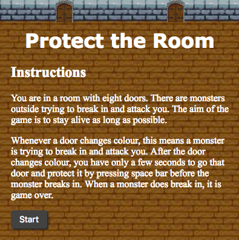

# Sparta-Core-Project-1

## Purpose
This game was built for a project during my time in training with Sparta Global, where I was required to build a browser-based game using HTML, CSS and JavaScript.

The purpose of the project was to reinforce my learning, demonstrate my knowledge and to demonstrate my ability to push myself forward.

### Requirements
The essential components of the game were an instructions section and a message displaying the user's score after the game had ended.

## Functionality
Once the game is opened a title, instructions for the game and a start button are displayed.




After the start button is clicked, the game can be played and runs until the game ending scenario is reached.

Here, a game over screen, also displaying your score, is displayed. The game over screen contains a button to take you back to the title screen.

## Issues
### Movement
Sometimes the game does not run as smoothly as intended. This is because I chose to use the 'keydown' function to move the character. As 'keydown' fires off a signal every millisecond, this can cause the game to slow down, jump and lag. This problem could be solved by researching another function which does not fire signals so frequently. The code is shown below:

```js
var keys = {};

// When a key is pushed down, it is added to the 'keys' object
$(document).keydown(function(e){
	keys[e.keyCode] = true;
})

$(document).keyup(function(e){
	delete keys[e.keyCode];
})

function movePerson(){
	for (var keySelected in keys) {
      if (!keys.hasOwnProperty(keySelected)) continue;
      
      if (keySelected == 39) {
		...
```

### DRY code
The 'if' statement below checks if each side of the character is inside a hit-box on the top or left walls. Two more similar 'if' statement to the one below had to be written depending on which wall the doors are on; one for the right wall and one for the bottom wall. However, if variables were defined for the edges of the hit-boxes, this calculation could be compressed into one 'if' statement more easily and other parts of the code would also benefit in similar ways

```js
if (occupiedDoors[i] <= 3) {
	if ($(`.door${occupiedDoors[i]}`)[0].offsetLeft <= $character[0].offsetLeft &&
	$(`.door${occupiedDoors[i]}`)[0].offsetLeft + 55 >= $character[0].offsetLeft && 
	$(`.door${occupiedDoors[i]}`)[0].offsetTop <= $character[0].offsetTop &&
	$(`.door${occupiedDoors[i]}`)[0].offsetTop + 35 >= $character[0].offsetTop) {
```

## Demo
https://bentostevin.github.io/Sparta-Core-Project-1/